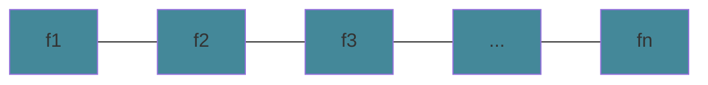
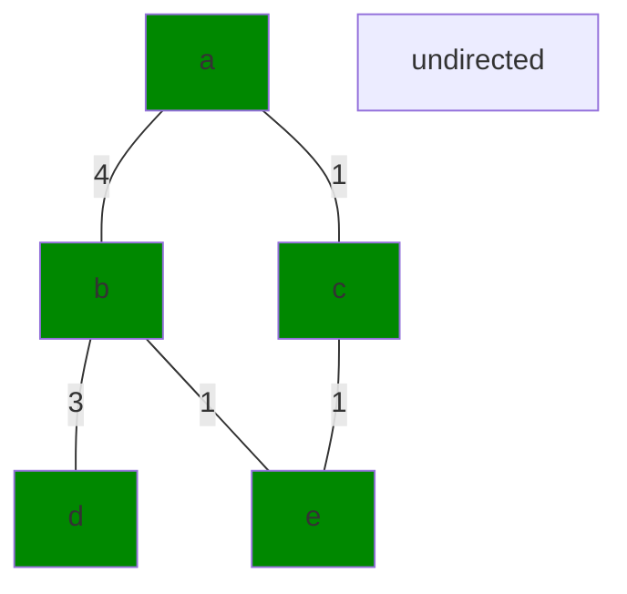
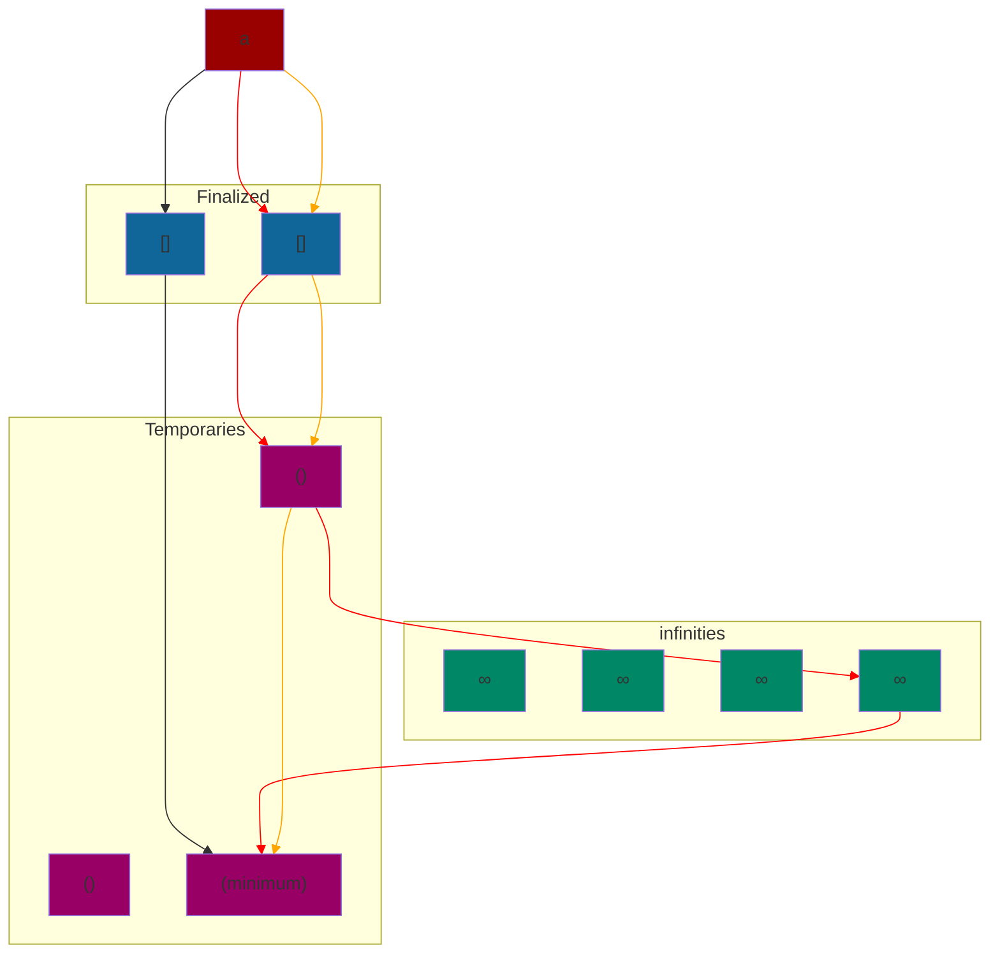
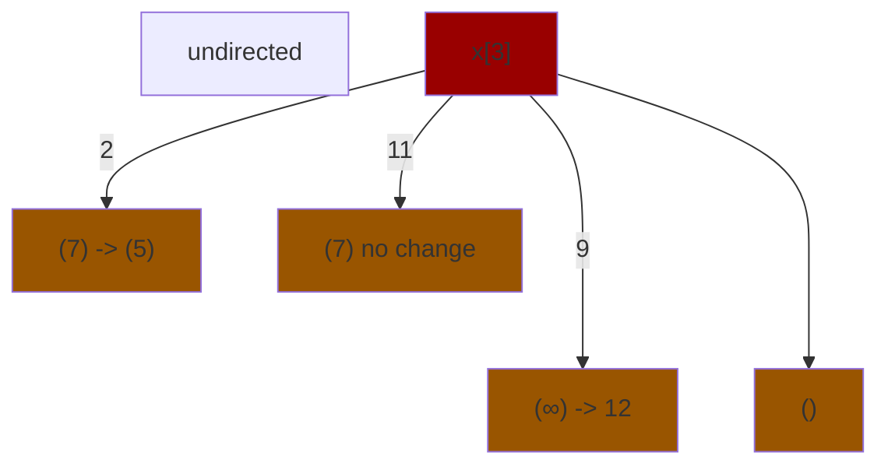
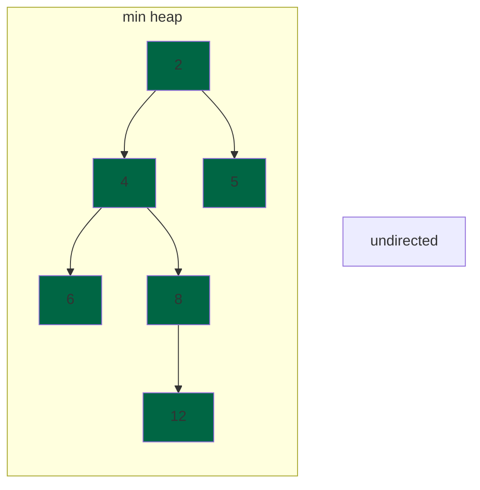

# Algorithm Paradigms

`global approach` you look at the overall problem to solve. 

Example: If you want to find a route from LA to SF, a global approach would be to look at all roads from LA to SF and decide what is the most `optimal` path.

`optimal` is described by what parameters you want to minimize or maximize.

## Greedy Algorithm

`greedy algorithm` you take a local approach. Greedy algorithms are quick but we may be unsure if it is optimal or not. Usually this takes `O(nlogn)`

Example: You are given a set of tasks. Give a subset of the tasks such that no tasks overlap.

The simplest solution is to return any 1 task.

Example: You are given a set of tasks. Give a subset of non-overlapping tasks such taht the number of tasks are maximized.

Greedy Solutions:

* pick tasks with shortest length
* pick tasks with the least number of scheduling conflicts
* pick tasks with first finish time and delete conflicting tasks.

Say `our` algorithm outputs 5 intervals. `Their` algorithm outputs outputs more than 5 intervals. For some `i` in the beginning, our algorithm outputs the same output as theirs. For some interval `A` in our algorithm and some interval `B` in their algorithm, there are two possibilities:

$$ f_B < f_A $$
$$ f_B > f_A $$

The first one will never happen by our definition because the algorithm always outputs the interval with the lowest finish time.

```
    Our Algorithm:
          i       i+1 f_A
        ----| ... ---|              // stays ahead
    Their Algorithm:
          i       i+1 f_B
        ----| ... -----|
```

Our first `i+1` interval stays ahead of their first `i+1` by our algorithm  definition. So by induction, our first `k` intervals is ahead of their `k` intervals.

There can never be an interval `X` such that they choose that we cannot choose.

```
    Our Algorithm:
          i       i+1 f_A
        ----| ... ---|              
    Their Algorithm:
          i       i+1 f_B   X
        ----| ... -----| |---|      // this can never happen because we can choose X
```

Therefore, Our greedy algorithm is optimal.

To run the algorithm, we need to sort the it in ascending finish times `O(nlogn)`



```
    for n elements in the sorted finish times:
        if s_{i+1} > f_i
            output f_{i+1}
```

This runs in `O(n)` time.

Total time complexity: `O(nlogn) + O(n)` = `O(nlogn)`

## Dijkstra's Shortest Path Algorithm

`weighted graph` the distance from a node `s` to node `t` is measured by the weights of the graph instead of the number of edges from `s` to `t`.



* Let `a` be the starting point
* go to adjacent nodes of visited nodes
* fix the weight of the shortest path

To do this we do the following:

* Pick the minimum of temporary weights and finalize it.



The orange and red path are not minimum paths because all of the weights on the graph are non-negative. We pick a minimum of the temporary weights and finalize it.

### Dijkstra's Algorithm with an Array Implementation:

```
    For n steps:
        pick minimum, x         O(n)
        move it to finalized    O(1)
        modify neighbors of x   O(n)
```

Total runtime of this algorithm is `O(n^2)`

Here is how we modify the adjacent nodes:



### Dijkstra's Algorithm with a Heap Implementation:

`heap` is a binary tree structure where the nodes follow a property for each sub-tree. A `min heap` has each parent node less than or equal to its child nodes. A `max heap` has each parent node greater than or equal to its child nodes. The smallest value of a min heap is always at the root.




This allows us to access the minimum value of a set of elements in `O(1)` time. When we extract a node, it takes at most `O(logn)` time to fix the tree. The function to fix the tree if it is out of order is `sift up` and `sift down`. We can build the heap using `heapify`.

Dijkstra's algorithm modifies through at most `m` edges time.  So it takes a total run time of `O(mlogn)` when we use a heap instead of arrays.

**Key Note** is it better to have `O(mlogn)` or `O(n^2)`

It depends. If the graph is dense, having an array implementation is better, but if the graph is sparse, a heap implementation is better.

$$
\begin{align*}
m\text{log}n &\ge n^2 \\
m &\ge \frac{n^2}{\text{log}n}
\end{align*}
$$

Mathematically if `m` is greater than or equal to `(n^2)/(logn)` the array implementation is better.

## Spanning Trees

`spanning tree` a tree that touches every vertex. To find a simple spanning tree, just do BFS.

`minimum spanning tree (MST)` is a spanning tree with the smallest weights

`MST Theorem` there exists an edge `e_min`, that is the lowest weight between any two partitions within the graph for a MST.
