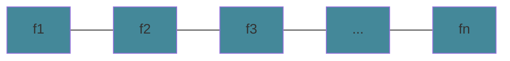

# Algorithm Paradigms

`global approach` you look at the overall problem to solve. 

Example: If you want to find a route from LA to SF, a global approach would be to look at all roads from LA to SF and decide what is the most `optimal` path.

`optimal` is described by what parameters you want to minimize or maximize.

## Greedy Algorithm

`greedy algorithm` you take a local approach. Greedy algorithms are quick but we may be unsure if it is optimal or not. Usually this takes `O(nlogn)`

Example: You are given a set of tasks. Give a subset of the tasks such that no tasks overlap.

The simplest solution is to return any 1 task.

Example: You are given a set of tasks. Give a subset of non-overlapping tasks such taht the number of tasks are maximized.

Greedy Solutions:

* pick tasks with shortest length
* pick tasks with the least number of scheduling conflicts
* pick tasks with first finish time and delete conflicting tasks.

Say `our` algorithm outputs 5 intervals. `Their` algorithm outputs outputs more than 5 intervals. For some `i` in the beginning, our algorithm outputs the same output as theirs. For some interval `A` in our algorithm and some interval `B` in their algorithm, there are two possibilities:

$$ f_B < f_A $$
$$ f_B > f_A $$

The first one will never happen by our definition because the algorithm always outputs the interval with the lowest finish time.

```
    Our Algorithm:
          i       i+1 f_A
        ----| ... ---|              // stays ahead
    Their Algorithm:
          i       i+1 f_B
        ----| ... -----|
```

Our first `i+1` interval stays ahead of their first `i+1` by our algorithm  definition. So by induction, our first `k` intervals is ahead of their `k` intervals.

There can never be an interval `X` such that they choose that we cannot choose.

```
    Our Algorithm:
          i       i+1 f_A
        ----| ... ---|              
    Their Algorithm:
          i       i+1 f_B   X
        ----| ... -----| |---|      // this can never happen because we can choose X
```

Therefore, Our greedy algorithm is optimal.

To run the algorithm, we need to sort the it in ascending finish times `O(nlogn)`



```
    for n elements in the sorted finish times:
        if s_{i+1} > f_i
            output f_{i+1}
```

This runs in `O(n)` time.

Total time complexity: `O(nlogn) + O(n)` = `O(nlogn)`

