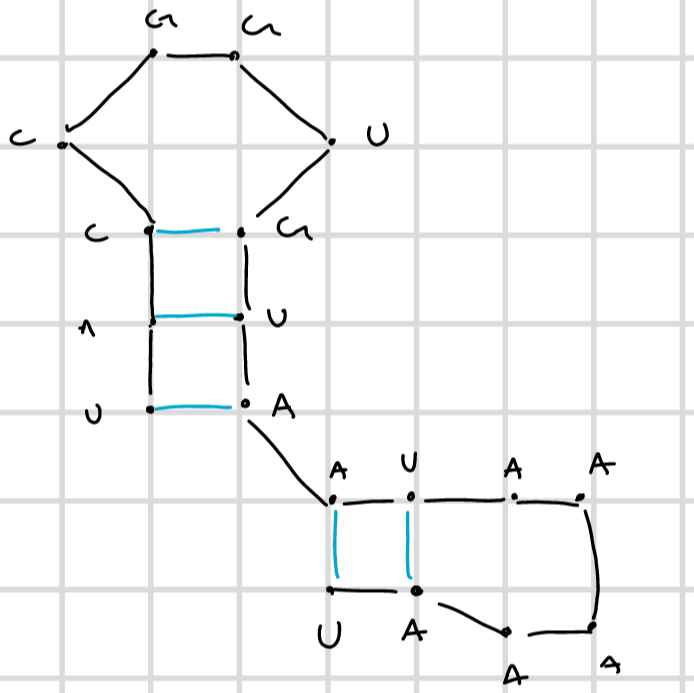

# Algorithm Paradigms

`global approach` you look at the overall problem to solve. 

Example: If you want to find a route from LA to SF, a global approach would be to look at all roads from LA to SF and decide what is the most `optimal` path.

`optimal` is described by what parameters you want to minimize or maximize.

## Greedy Algorithm

`greedy algorithm` you take a local approach. Greedy algorithms are quick but we may be unsure if it is optimal or not. Usually this takes `O(nlogn)`

Example: You are given a set of tasks. Give a subset of the tasks such that no tasks overlap.

The simplest solution is to return any 1 task.

Example: You are given a set of tasks. Give a subset of non-overlapping tasks such taht the number of tasks are maximized.

Greedy Solutions:

* pick tasks with shortest length
* pick tasks with the least number of scheduling conflicts
* pick tasks with first finish time and delete conflicting tasks.

Say `our` algorithm outputs 5 intervals. `Their` algorithm outputs outputs more than 5 intervals. For some `i` in the beginning, our algorithm outputs the same output as theirs. For some interval `A` in our algorithm and some interval `B` in their algorithm, there are two possibilities:

$$ f_B < f_A $$
$$ f_B > f_A $$

The first one will never happen by our definition because the algorithm always outputs the interval with the lowest finish time.

```
    Our Algorithm:
          i       i+1 f_A
        ----| ... ---|              // stays ahead
    Their Algorithm:
          i       i+1 f_B
        ----| ... -----|
```

Our first `i+1` interval stays ahead of their first `i+1` by our algorithm  definition. So by induction, our first `k` intervals is ahead of their `k` intervals.

There can never be an interval `X` such that they choose that we cannot choose.

```
    Our Algorithm:
          i       i+1 f_A
        ----| ... ---|              
    Their Algorithm:
          i       i+1 f_B   X
        ----| ... -----| |---|      // this can never happen because we can choose X
```

Therefore, Our greedy algorithm is optimal.

To run the algorithm, we need to sort the it in ascending finish times `O(nlogn)`


```
    for n elements in the sorted finish times:
        if s_{i+1} > f_i
            output f_{i+1}
```

This runs in `O(n)` time.

Total time complexity: `O(nlogn) + O(n)` = `O(nlogn)`

## Divide and Conquer Paradigm

Given this list, sort it in non-decreasing order. We are going to use `merge sort`.


$$
\text{Divide until you can do comparisons}
$$


$$
\text{merge}
$$


$$
\text{merge}
$$


To do the `merge` operation, we initialize two pointers at the start of the lists we are trying to merge. Put the minimum of the pointer into the output list and move the pointer to the next element. This takes `O(mn)` since we compare each m element with at most n elements. But this is pretty pessimistic. If we change our accounting method, this takes `O(m+n)`. If `m_i` is compared with every n, it would take `O(n)` since all values after `m_i` is greater than all n. Likewise it takes `O(m)` to compare `n_i` with all values of m. Therefore it take `O(m+n)`.

### Runtime Analysis for Recursive Algorithms:

`merge sort`

$$
\begin{align*} 
T(n) &= T(\frac{n}{2}) + T(\frac{n}{2}) + O(n)\\
&= 2T(\frac{n}{2}) + cn\\
&= 2(2T(\frac{n}{4}) + \frac{cn}{2})+ cn\\
&= 2^2T(\frac{n}{2^2})+ 2cn\\
&\vdots\\
&=2^iT(\frac{n}{2^i})+icn\\
T(1) = 1\\
\frac{n}{2^i} = 1\\
2^i = n \implies i = \log n\\
&= 2^{\log n}T(\frac{n}{2^{\log n}}) + cn \log n\\
&= nT(1) + cn\log n\\
&= O(n \log n)
\end{align*}
$$

`binary search`

$$
\begin{align*} 
T(n) &= T(\frac{n}{2}) + c\\
&= (T(\frac{n}{4}) + c) + c\\
&= T(\frac{n}{2^i})+ ic\\
T(1) = 1\\
\frac{n}{2^i} = 1\\
2^i = n \implies i = \log n\\
&= T(\frac{n}{2^{\log n}}) + c\log n\\
&= O(\log n)
\end{align*}
$$

### Crossing Number Problem

`crossing number` the number of elements that are out of order in a nondecreasing list. The minimum crossing number for any list is 0. The maximum crossing number in any list is ${n\choose 2}$.

Say you have a list `1 4 3 5 7 6`. The crossing number is `2`.

To solve this problem we will:

* run merge sort
* the crossing number of output is incremented by `x+1` whenever we add an element from the right side to the output. x + 1 is the number of indices on the left partition from current index to the end of the list. If there is a output from the right, that means it crosses all elements on the left side's current index to the end.

## Dynamic Programming (DP)

### Weighted Interval Scheduling

In a weighted interval scheduling problem, we want to maximize the total weight of intervals while not picking overlapping intervals.

We can do this by looking for the optimal solution from time $0$ to time $t$.

```
                  Wx
    |         |-------| |
              Sx      Fx

    | --------------->| |
                    t-1

    | ----------------->|
    0                   t
```

What is the best interval from $0$ to $t$? The most optimal solution can be denoted as `opt(t)`. 

$$
\begin{align*}
&x \in \text{ solution} \implies \text{opt}(t) = \text{opt}(S_x - 1) + W_x\\
&x \notin \text{ solution} \implies \text{opt}(t) = \text{opt}(t-1)
\end{align*}
$$

`opt(t)` is the max of these cases and can be denoted as:

$$
\text{opt}(t) = \text{max}(\text{opt}(S_x-1) + W_x, \text{ opt}(t-1))
$$

If the problem asks for the intervals that contribute to the optimal solution, we must backtrack from the end. The optimal solution is only determined once we have found `opt(T)` where T is the total period of time we want to run the algorithm on.

### Knapsack Problem

Suppose we have `n` number of items, `I` each with two attributes, `S` for size, and `v`, for value. For the Knapsack problem, we want to maximize the value of items such that the items fit into the bag. We will first consider the variation where there is an infinite supply of each item.

The sum of items must be less than or equal to the capacity of the knapsack such that the total value is maximized.

| | $1$ | $2$ | $...$ | $S$ |
| --- | --- | --- | ---| --- |
| $I_1$ | $v1$ or 0|  | ... |
| $I_2I_1$ | |  | ... | |
| $\vdots$ | |  | ... | |
| $I_n...I_2I_1$ | | | | final solution |

The square $(I_1, 1)$ can either contain `v1` or `0` because a knapsack of size 1 can contain items with size 1 or less. If `v1` happens to be smaller than the capacity of this knapsack, we can say opt(1, 1) is `v1`.

Generally, for any opt(i,j):

$$
I_i \in \text{ solution} \implies \text{opt}(i, j) = \text{opt}(i, S_j - S_i) + V_i
$$

because $S_j - S_i$ denotes the space remaining if we put $I_i$ in the knapsack.

$$
I_i \notin \text{ solution} \implies \text{opt}(i, j) = \text{opt}(i - 1, S_j)
$$

$$
\text{opt}(t) = \text{max}(\text{opt}(i, S_j - S_i) + V_i, \text{ opt}(i - 1, S_j))
$$

For our implementation:

```
    for 1 <= i <= n
        for 1 <= j <= S
            do main equation
```

Time Complexity:

There are `n` rows and `S` columns in the table. It takes `O(ns)`. THis is not polynomial time. We call this `pseudo polynomial` because everytime we add one to `S`, the number of rows grows by `n`. The runtime is proportional to the value of `S`, but it is exponential to the memory needed to store that value.

## Dynamic Programming

### Top Down Approach

1) Break problem into overlapping subproblems
2) Solve the subproblems via recursion
    * keep track of previously solved subproblems to limit the size of the recursion tree(memoization)
3) Combine subproblem solutions to get solution

### Bottom Up Approach

Replace step `2` of the top down approach with:

Systematically solve subproblem using previously solved subproblems

### RNA Structure Problem

* Have an RNA sequence $R$ represented by a string of length $n$ over the alphabet $\{A, U, C, G\}$

Example: `UACCGGUGUAAUAAAAAU`



Matching: A matching on two sets $A$ and $B$ is a set of ordered pairs $(a, b)$ from $A \times B$ where:

* every element $a$ contained in $A$ appears in at most one pair
* every element $b$ contained in $B$ appears in at most one pair

Def: An RNA structure on a sequence $R = r_1, r_2, ..., r_n$ is a matching $S$ between sets ${1, 2, ..., n}$ and ${1, 2, ..., n}$ satisfying:

1. Correct Base Pairs: if $(i, j)$ in $S$, then: $(i,j)$ is a an element of ${(A,U), (C, A), (C, G), (G, C)}$

2. No sharp turns: if $(i, j) \in S$ then $i < j - 4$

3. No crossings: if $(i,j), (k,l) \in S$ then we cannot have $i < k < j < l$

#### Problem Statement:

Given an RNA sequence $R$, find the size of the RNA structure with maximum number of matches

1st Things to Try:

1. `opt(i)` = optimal solution over 1st `i` elements

#### First attempt:

`opt(i)` = size of the maximal RNA structure on $r_1, r_2, ..., r_i$

Say we already computed `opt(1)` to `opt(i-1)` and we add $r_i$

case 1: $r_1$ is unmatched:

`opt(i) = opt(i-1)`

case 2: $r_i$ is matched with $r_t$ for $1 \le t \lt i-4$

We cannot have a pairing between the set between $r_1 - r_{t-1}$ and $r_{t+1} - r_{i-1}$

The left set can be described as `opt(t-1)` but the right one cannot be described by our current optimal solution.

#### Solution

`opt(i, j)` = size of maximal RNA sequence on $r_i, r_{i+1}, ..., r_j$

case 1: $r_j$ is unmatched:

`opt(i, j) = opt(i, j-1)`

case 2: $r_j$ is matched with $r_t$ for $i \le t \lt j-4$

The left range of $r_t$ is `opt(i, t-1)` and the right part is `opt(t+1, j-1)`

`opt(i, j) = opt(i, t-1) + 1 + opt(t+1, j-1)`

Recurrence:

`opt(i, j) = max(opt(i, j-1), max{from i <= t < j-4}(opt(i, t-1) + 1 + opt(t+1, j-1)))`

#### Algorithm (R = r1, r2, ..., rn):

```c++
    Initialize an n by n array called opt (index starting from 1, not 0)
    for (size = 0; size <= n; size++) {
        for (i = 1; i <= n - size; i++) {
            j = i + size
            if (i >= j-4) {
                opt[i][j] = 0
            } else {
                opt[i][j] = max(opt[i][j-1], max_from(i <= t < j-4)(opt[i][t-1] + 1 + opt[t+1][j-1]))
            }
        }
    }
    output opt[1][n]
```

Time complexity:

* for the nested for loop, it takes `O(n^2)`
* computing `opt[i][j]` computes for all `t` so it takes `O(n)`
* Total time complexity = `O(n^3)`


### Sequence Alignment

Given two strings $X = x_1, x_2, ..., x_n$ and $Y= y_1, ..., y_m$

Alignment: An aligmenet $S$ of strings $X = x_1, x_2, ..., x_n$ and $Y= y_1, ..., y_m$ is a matching between the sets $\{1, ..., n\}$ and $\{1, ..., m\}$ such that there is no crossing pairs

Def: Let $S \ge 0$ and let $\alpha_{p, q} \ge 0$ for all symbols $p, q$.

* $S$ denotes the gap penalty
* $\alpha_{p, q}$ denotes the mismatch penalty

The cost of an alignment $\delta$ between $X$ and $Y$ with respect to $(\delta, \{\alpha_{p, q}\})$ is the sum of the following penalties:

1. for every unmatched elements in $X$ or $Y$, incure penalty $\delta$
2. for every matched pair $(x_i, y_j)$ incur penalty $\alpha_{x_i, y_i}$

#### Problem Statement:

Given $X, Y$ and values $(\delta, \{\alpha_{p, q}\})$, find the cost of the minimum cost alignment between $X$ and $Y$

Here is a special subcase: corresponds to the longest common subsequence

$$
\delta = 1
$$ 

$$
\alpha_{p,q} = \begin{cases}
0 \text{ if } p = q \\
\infty \text{ elsewhere}
\end{cases}
$$

Common subproblems:

* `opt(i)` = optimal over 1st `i` elements
* `opt(i, j)` = optimal over elements `i` through `j`
* `opt(i, j)` = optimal over `i` elements and `j` elements

Define: `opt(i, j)` = cost of min alignment on $x_1, x_2, ..., x_i$ and $y_1, y_2, ..., y_j$

Goal: find `opt(n, m)`

Assume we already computed `opt(j, k)` for all `(j, k)` pairs

Case 1: Match $x_i$ with $y_j$

$x_1, ..., x_{i-1}, x_i$

$y_1, ..., y_{j-1}, y_j$

`opt(i, j)` = `opt(i-1, j-1)` + $\alpha_{x_i, y_j}$

Can $x_i$ be matched with $y_k$ for $k \lt j$ and $y_j$ be matched with $x_l$ for $l \lt i$?

$x_1, ..., x_l,..., x_i$

$y_1, ..., y_k,... y_j$

No this would result in a crossing

Observation: In strings $x_1, x_2, ..., x_i$ and $y_1, y_2, ..., y_j$, if $x_i$ is not matched with $y_j$, then at most one of $x_i$ or $y_j$ can be matched (otherwise we would have a crossing)

Case 2: $x_i$ is unmatched

$x_1, ..., x_{i-1}, x_i$

$y_1, ..., y_j$

`opt(i, j)` = `opt(i-1, j)` + $\delta$

Case 4: $y_j$ is unmatched

$x_1, ..., x_i$

$y_1, ..., y_{j-1}, y_j$

`opt(i, j)` = `opt(i, j-1)` + $\delta$

So overall:

`opt(i, j)` = `min`(`opt(i-1, j-1)` + $\alpha_{x_iy_j}$, `opt(i-1, y)` + $\delta$, `opt(i, y-1)` + $\delta$)

#### Algorithm $(X = x_1...x_n, Y = y_1...y_m, \delta, \{\alpha_{pq}\})$

1. Initialize and $n+1 \times m+1$ array called `opt`
2. set `opt[0][j]` = $j\delta$ for all `j`
3. set `opt[i][0]` = $i\delta$ for all `i`
4. for (i=1; i<= n; i++)
        
    * for(j=1; j<= m; j++)
            
        * `opt(i, j)` = `min`(`opt(i-1, j-1)` + $\alpha_{x_iy_j}$, `opt(i-1, y)` + $\delta$, `opt(i, y-1)` + $\delta$)
5. output `opt[n][m]`

Runtime = `O(mn)`

### Bellman-Ford Algorithm

#### Problem Statment

Given a directed weighted graph $G = (V, E)$ and two nodes $(s, t)$, find the minimum cost from $s$ to $t$. 

* Allow negative weight edges
* Disallow negative cycle

`opt(v)` = shortest "known" path from $s$ to $v$

Then for $v \ne s$

`opt(v)` = min neighbors, $u$ of $v$(weight$(u,v)$ + `opt(u)`)

This works for DAGs but no the general case.

Problem: We many not have computed `opt(u)` by the time we need to compute `opt(v)`

`opt(i, v)` = cost of min cost path from $S$ to $v$ that uses at most $i$ edges.

`opt(i, v)` = min(min in-neighbors $u$ of $v$(weight $(u, v)$ + `opt(i-1, u)`), `opt(i-1, v)`)

Question: How big does $i$ need to get bfore we're confident we've determined the minimum cost path?

Observation: if no negative cycles, then there is a min cost path which is a simple path(no repeated nodes)

Answer: $i = n-1$ is sufficient

After $n$ edges, we'll have touched $n+1$ nodes which means there is a repeated node(cycle). Because there is no negative cycle, removing the cycle will lead to a path with fewer edges and cost at least as small as original path.

#### Algorithm $(G=(V,E),s,t)$

1. let $n$ = number of nodes in $G$. Assume $V = \{0, 1,..., n-1\}$
2. Create a $n\times n$ array called `opt`
3. set `opt[0, s]` = $0$ and `opt[0, v]` = $\infty$ for all $v\ne s$
4. for (i = 1; i < n; i++)
    * for $v \in V$
        * `opt[i, v]` = min(min in-neighbors $u$ of $v$(weight $(u, v)$ + `opt(i-1, u)`), `opt(i-1, v)`)
5. output `opt[n-1, t]`

Time complexity:

The for loops take 
$$
\begin{align*}
O(\sum_i \sum_v (1 + \text{ in-deg}(v))) \\
&= O(\sum_i(n+ \sum_v \text{ in-deg}(v))) \\
&= O(\sum_i (n+m))\\
&= O(n(n+m))
\end{align*}
$$

#### Finding Optimal Solution (not just value)

`Find-Min-Cost-Path(opt, s, t)` this is given from Bellman-Ford

* Look at what letd to `opt(i, t)`'s value
* here are the possible choices:
    * a = `opt(i-1, t)` recurse on `Find-Min-Cost-Path(opt(i-1), s, t)`
    * b = `opt(i-1, u)` + weight$(u,v)$ for some in-neighbor of $t$. This is the output of `Find-Min-Path(opt, i-1, s, u)` + weight $(u, t)$
* `opt(i)` = optimal over 1st `i` elements
* `opt(i, j)` = optimal over elements `i` through `j`


