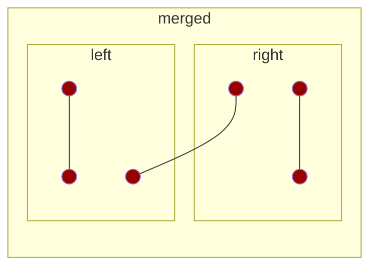

# Closest Pair Problem:

Distance between any two points is defined as $\sqrt{(y_1 - y_2)^2 + (x_1 - x_2)^2}$

Which pair of points is the shortest distance?

The trivial solution is to calculate each distance between each point. There would be 

$$(n-1)+(n-2)+(n-3)+...+1$$

steps which results in a $O(n^2)$ solution.

Let's use a divide and conquer approach to this problem. Given `n` points with `x` and `y` values, partition the points into $\frac{1}{2}$ recursively using the x values of each point until we get one point in each partition. This is similar to `merge sort`.

Our next step is to merge the two partitions. For any two partitions the closest pair, `Cp` can either be `Cpl` closes pair from left, `Cpr` closest pair from right, or `Cplr` closes pair from left to right.

Suppose we seperate the partitions so that we only look at $\delta = \text{min}(\delta_1, \delta_2)$ This limits our view to only points that can be less than the lowest distance we already know. Comparing every distance between these partitions would still be on an order of $n^2$.

Suppose for point `i` in the left partition, there are 8 boxes in the right partition. Each box is size $\frac{\delta}{2}$. The maximum distance within one square would be $\frac{\sqrt{2}\delta}{2}$. Since the minimum distance is $\delta$ within each partition, there can be only one point per box.

Now we will consider the y-axis of the problem.

| | | | |
| --- | --- | --- |---|
| x | x | point | point |
| i | x | point | point |
| x | x | point | point |
| x | x | point | point |

For any `i` point on the left, there could be a maximum of 8 points above and 8 points below it that we need to consider. The `x`'s represent the boxes on the left partition and the right side of the table represents the possible point positions. 

Therefore we can now look at the y axis as a line of 16 points. A linear scan of all points on this line would take

$$\frac{n}{2}\times 16 = 8n$$

So this merge step is on the order of `O(n)`. When we scan through this line, we ignore points on the left partition.

$$
T(n) = 2T(\frac{n}{2}) + cn + cn
$$

The first `cn` is for the x merge and the second `cn` is for the y-merge.
