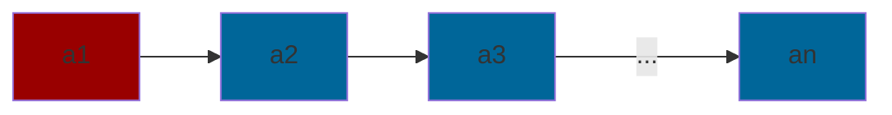
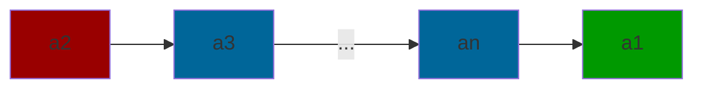
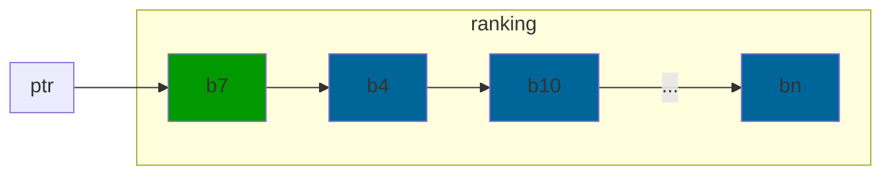
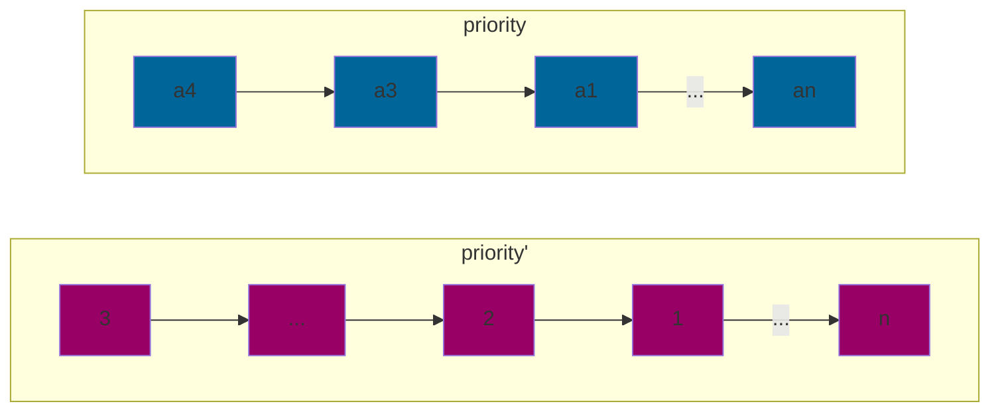

# Famous Problem and Stable Matching Problem

## Famous Problem

There is one famous person everyone knows but the famous person knows nobody.

Restrictions (what the processor can do):


Optimize:

Minimize the number of questions asked.

### Solution 1

After `n-1` questions, we know if everyone knows an individual

After another `n-1` questions, we know if that individual does not know anyone. 

It takes `2(n-1)` questions to know if an individual is famous.

$\therefore$ it takes `n(2(n-1))` questions to know if anyone is famous. 

This solution runs in `~n^2` questions.

### Solution 2


| Questions | n |
| --- | --- |
| 1 | n-1 |
| 2 | n-2 |
|3 | n-3 |
|$\vdots$ | $\vdots$ |
| n-1 | 1 |

The process above takes `n-1` questions to ask all but one person if they know someone. The last person takes `2(n-1)` questions to verify if they are famous. In total the run time of this algorithm is:

`n-1` + `2(n-1)` = `3(n-1)`

runtime `~n` questions

This is an optimal algorithm because if we ask `n-1` questions, that last person does not give us info. This changes the outcome. So we know that this is an optimal algorithm.

### Model of Computation:

Serial Model of Computation

* simple
* universal


**Example:** $S = \sum_{i=1}^{n}x_i$

| Operation | time taken |
| --- | --- |
| input to memory and register | `2n` |
| $x_1\rightarrow$ ALU  | `1`|
| $x_2\rightarrow$ ALU  | `1`|
| + | `1`|
| $x_3\rightarrow$ ALU  | `1`|
| + |$\vert$|
| $\vdots$ | $\vdots$ |
| $x_n\rightarrow$ ALU | `1`|
| + | `1`|
| output | `1` |

Loading every input to the memory and the registers take `2n` units of time.

Loading the first $x$ value to the ALU takes `1` unit of time.

Each operation from $x_2$ to the final  $+$ operation takes `2(n-1)` units of time. Since we exclude $x_1$, there are `n-1` pairs of operations. Each pair of $x_i\rightarrow$ ALU operation and addition operation takes 2 units of time, so we get `2(n-1)` runtime.

Our total runtime = `2n + 1 + 2(n-1) + 1`

= `2n + 2 + 2n - 2`

= `4n`

`~n` runtime

## Stable Matching Problem

There are two groups, $A$ and $B$ of the same cardinality. We need to match a member of $A$ to $B$ while following restrictions. Every match is a perfect match. Every person is matched with exactly one person.

`Stable Matching` every element ranks all of the possible matches from the other set

* this is called a complete ranking (priority list)

When there are no restrictions to a matching problem, the simplest solution is the best solution.

* match every $a_i$ to $b_k$  and we have the simplest solution.

### Unstable Pattern:


$a1$ has ranking of $(...2...1...)$ and $b2$ has ranking of $(...1...2...)$

If this pattern occurs it is considered an `unstable match`. Matching is `stable` if this pattern does not occur.

**Note: There is always a stable match!**

### Solution:

```
    a[i] asks b[k] to match
    if b[k] has no match:
        yes, (a[i], b[k]) match
    if b[k] has match with a[j]:
        if rank(a[j]) > rank(a[i])
            no, do not match
        else:
            yes, (a[i], b[k]) match
```

$a_i$ goes through at most `n` iterations before finding a match.

There are `n` number of a's in the set of the matching problem.

steps = `nxn` = `n^2`

steps `~n^2`

How do we know that an unstable pattern will not happen in our algorithm?

#### Proof by Contradition:

Assume an unstable match happens.


$a$ has ranking of $(...b'...b...)$ and $b'$ has ranking of $(...a''...a...a'...)$

Did $a$ ask $b'$ in the past?

case1 `no`: 

* contradition to our algorithm. If $a$ has matched with b, then it must have asked $b'$ in the past because $b'$ is ranked higher than $b$.

case2 `yes`: 

* if $a$ has asked $b'$ before, then that means that $b'$ had a match with another element, $a''$, that had higher rank than $a$. We can establish the ranking as $a'' \gt a \gt a'$. Because $b'$ ends up with $a'$, it is a contradiction to $a'' \gt a'$.

$\therefore$ this unstable pattern will never happen in our algorithm.

There are three parts in running each step in the algorithm:

1. Find an unmatched A
2. $a_1$ requests a match with $b_k$
3. $b_k$ decides on a match

### Part 1: Find Unmatched A





Delete $a_i$ after each operation. Append $a_i$ if it is not matched. This process takes `~1` unit of time.

### Part 2: $a_i$ Requests a Match



Move pointer to the next ranking (the first one if it is the first iteration) and request a match with $b_i$. This also takes `~1` unit of time.

### Part 3: $b_k$ Decides to Match

If $b_k$ is not matched, this will take `~1` unit of time. However in the worst case, $b_k$ has a match with some $a_k$, One solution would be to iterate through the whole ranking of $b_k$. This would take `n-1` or `~n` time. This creates a very slow solution because we get a runtime of `n^2 x n` or `~n^3`. 

Instead we create a priority' list:



It takes `n` time to create priority' list. There are `n` priority' lists in the whole set of B. This takes `nxn` runtime or `~n^2` runtime at compile time.

Because this is done at the beginning of the program outside of the loop, the total runtime of our new solution is: `n^2 + n^2 x 1 = 2n^2` or `~n^2` time.

## Asymptotic Analysis:

We are interested in runtime for `large n` as opposed to `small n`. 

We can categorize the runtimes of our algorithm with a capital $O(n)$ or Order Notation. This is the worst case runtime:

$$ f(n) = O(g(n))\newline
\exists \text{ constant }c\text{ and }n_0 \mid f(n) \leq cg(n), n \ge n_0
$$

In simple terms $O(n)$ time tells us how fast an algorithm's runtime grows relative to the size of the input for large input values of `n`. 

Additionally there is $\Omega (n)$ for best case scenarios:

$$ f(n) = \Omega (g(n))\newline
\exists \text{ constant }c\text{ and }n_0 \mid f(n) \geq cg(n), n \ge n_0
$$
