# Graphs

`Graphs` contain `vertices` and `edges`. 

* A `vertex` is a node or point on a graph
* An `edge` connects vertices

There are many types of graphs:

* `weighted` graphs have edges that have a value/weight assigned to them
* `directed` graphs have one way connections between vertices
* `undirected` graphs, or simply graphs, is a graph that has edges that are the same in either orientation. (a, b) is the same as (b, a)
* `connected` graphs have all vertices on the graph connected together.
* `not connected` graphs have at least two distinct groups of vertices that are connected independently.

$G = (v, E)$ where $v = \{a,b,c,d\}$ and $E = \{(b,c),(b,a),(b,d)\}$

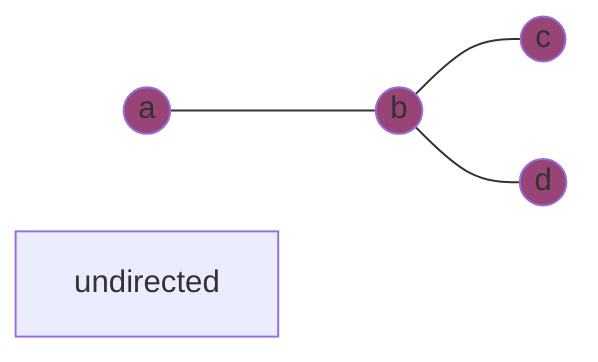

A `simple path` does not repeat any vertices or edges. 

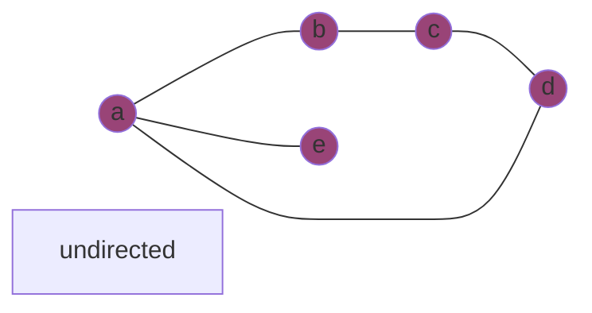

* $a,b,c,d$
* $b,a,e$

A `cycle` ends at the same starting point 

* $a, b, c, d, a$

There are two techniques to searching graphs. `BFS`, breadth first search, and `DFS`, depth first search. We will use the notation: $|v| = n$ and $|E| = e$.

## BFS, Breadth First Search

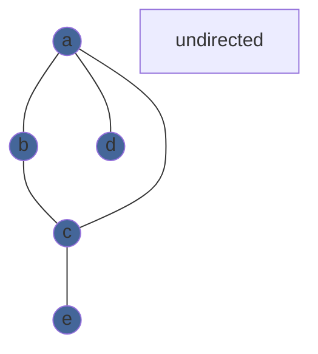

To do a BFS, we visit vertices in layers. 

1. visit $a$ - adjacency list: $b, c, d$
2. visit $b$ - adjacency list: $a, c$
3. visit $c$ - adjacency list: $a, b, e$
4. visit $d$ - adjacency list: $a
5. visit $e$ - adjacency list: $c$

Every vertex checks its link to the previous layer. The runtime $= 2e = O(E)$

## DFS, Depth First Search

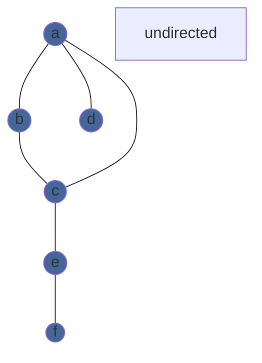

To do a DFS, we visit vertices down to a dead end and then backtrack while looking for more branches in the path.

1. visit $a$ - visited list: $a$
2. visit $b$ - visited list: $a, b$
3. visit $c$ - visited list: $a, b,c$
4. visit $e$ - visited list: $a, b,c,e$
5. visit $f$ - visited list: $a, b,c, e, f$, no more unvisted vertices
6. go back to $e$ - no unvisted vertices
7. go back to $c$ - no unvisted vertices
8. go back to $b$ - no unvisted vertices
9. go back to $a$ - $d$ is unvisted
10. visit $d$ - visited list $a, b, c, e, d, f$, no more unvisted vertices
11. go back to $a$ - no unvisted vertices left

Every visited vertex has to trace back to its previous vertex so the runtime $= 2e = O(E)$.

There are two ways to keep track of which vertices are connected. `Adjacency Lists` are lists with all the adjacent vertices of a vertex. There are `|v| = n` number of adjacency lists.

* $a \rightarrow b \rightarrow c \rightarrow d$
* $b \rightarrow a \rightarrow c$
* $c \rightarrow a \rightarrow b \rightarrow e$
* $e \rightarrow c \rightarrow f$
* $f \rightarrow e$
* $d \rightarrow a$

It will take $O(n)$ to see if a specific vertex is in an adjacency list. For this reason, adjacency lists are good to use when we have `sparse graphs`.

We can also use matrices to model which vertices are connected:

Undirected graphs' matrices: 

$$\begin{array}{rcl} &\color{white}\begin{array}{c}a & b & c & d & e & f\end{array}\\
\color{white}\begin{matrix} a \\ b \\ c \\ d \\ e \\ f \end{matrix}\color{black}\hspace{-1em}
&\begin{pmatrix}
1&1&1&1&0&0\\
1&1&1&0&0&0\\
1&1&1&0&1&0\\
1&0&0&1&0&0\\
0&0&1&0&1&1\\
0&0&0&0&1&1\\
\end{pmatrix} 
\end{array}
$$ 

are always symmetric because of the nature how pairs of vertices will have the same edge.

Directed graphs' matrices: 

$$
\begin{array}{rcl} &\color{white}\begin{array}{c}a & b\end{array}\\
\color{white}\begin{matrix} a \\ b\end{matrix}\color{black}\hspace{-1em}
&\begin{pmatrix}
1&1\\
0\\
\end{pmatrix} 
\end{array}
$$

may not be symmetric. In this example, $a \rightarrow b$, the source node is represented by the matrix's rows and the target node is represented with the columns.

### Example:

#### If the graph is connected, what is the minimum number of edges?

There are `n` vertices in a connected graph. The minimum number of edges is `n-1`. So for all graphs, the number of edges lies within $n-1 \le e$. A tree is described as a graph with exactly $e = n-1$ edges. Graphs with generally small number of edges is considered a `sparse graph`.

#### If the graph is connected, what is the max number of edges?

Since each edge has 2 vertices, the max number of edges can be described by:

$$
{n\choose 2} = \frac{(n-1)(n)}{2}
$$

This is called a `complete graph`. All of the vertices are connected with each other, so that there is no vertex that is not matched with all others in the graph. This is considered a `dense graph`.

## How are BFS and DFS Implemented?

Let's go back to the example used for BFS:


For BFS, we use a `FIFO` first-in-first-out data structure.

```mermaid
    graph LR
        subgraph Priority Queue
            direction LR
            a --- c
            c --- b
            b --- d
            d --- e
        end
        style a fill:#036
        style b fill:#036
        style c fill:#036
        style d fill:#036
        style e fill:#036
```

For DFS, we use a `FILO` first-in-last-out data structure.

```mermaid
    graph LR
        subgraph Stack1
            direction TB
            e --- c
            c --- b
            b --- a1
        end
        subgraph Stack2
            direction TB
            d --- a2
        end
        Stack1 ---> Stack2
        style a1 fill:#036
        style a2 fill:#036
        style b fill:#036
        style c fill:#036
        style d fill:#036
        style e fill:#036
```

`Length` is the number of edges from one vertex to another.

`Distance` is the length of the shortest path from one vertex to another.

* this is denoted as `dist(a,x)` where `a` and `x` are vertices.

Prove: dist($a,x$) = level of $x$

* we need to prove that there is a path of length $i$ from $a$ to $x$.
* we need to prove that there is no shorter path, length $j$ from $a$ to $x$

Assume that $a$ is on level 0 and $x$ is on level $i$. Do BFS.

```mermaid
    graph LR
        subgraph level i
            direction TB
            x
        end
        subgraph level 1
            direction TB
            e
            f
            g
        end
        subgraph level 0
            direction TB
            a
            b
            c
            d
        end
        style b fill:#036
        style c fill:#036
        style d fill:#036
        style e fill:#036
        style a fill:#036
        style f fill:#036
        style g fill:#036
        style x fill:#036
```

$$
\exists \text{ path of length } i \text{ between }x\text{ and }a
$$

By Contradition: Assume there is a shorter path of length $j$ at level $i$.

| Level | possible path length |
| --- | --- |
| 0 | 0 |
| 1 | 1 |
| 2 | 2, 1 |
| 3 | 3, 2, 1 |
| $\vdots$ | $\vdots$ |
| $x$ | $j$, $j$-1, $j$-2, ... , 1 |

$j$ could be at either level $j$ or any lower levels because some vertices are connected closer to $a$ at level 0.

Example: A triangle formed by $a$, $b$, $c$. If $a$ is the starting point, $b$ and $c$ are both on level 1, eventhough we may travel from $a \rightarrow b \rightarrow c$ to reach $c$. A straight line is the example of them descending levels after every edge.

However, since $x$ is at level $i$, which is a different number from $j$, and $x$ cannot be in multiple levels at the same time, there must be no shorter path of length $j$ from $a$ to $x$.

## Topological Sorting

`topological sorting` is an ordering with vertices such that the edges follow the precedence relationship.

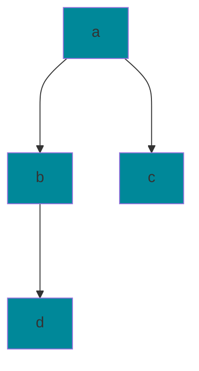

Vertices represent tasks. Edges represent the precedence relationship. Example: `(a, b)` means that `a` has to be done before `b`.

The following are correct topological orderings:

* `a b d c`
* `a b c d`

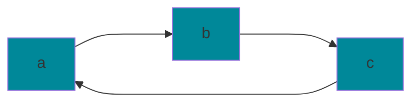

In this graph, we say that `b` is adjacent to `a` but `a` is not adjacent to `b` because it is directed. `Cycles` do not have topological ordering. We denote this triangular graph as `C3`, a cycle with length 3.

In an undirected graph: `degree` of a vertex is the number of edges that it is connected to.

In a directed graph:

* `in-degree` of a vertex is the number of incoming edges.
* `out-degree` of a vertex is the number of outward edges.

A vertex with in-deg = 0 is a `source`.

A vertex with out-deg = 0 is `sink`.

`DAG` is a directed acyclic graph. DAGs must have at least one source.

### Solution to Determining the Topological Ordering of a DAG:


1. Calculate all indegrees. `O(e)`
2. if in-deg = 0, it is a source. `O(n)`
3. Find a source. `O(1)`
4. Output source. `O(1)`
5. Decrement in-deg from vertices that connect to the deleted source. For the whole algorithm this takes `O(e)`

Runtime = `O(n + e)`

### 2-coloring

a graph is `2-colorable` if no adjacent vertices have the same color.

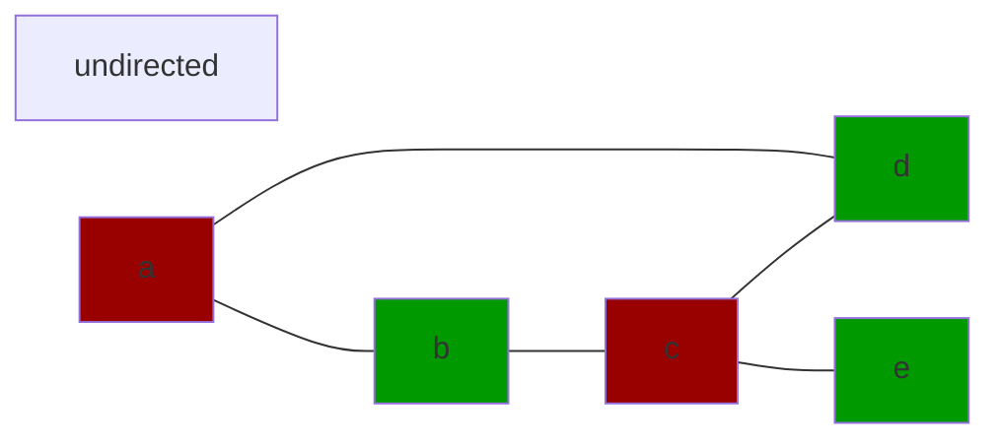

graphs that contain odd length cycles are not 2-colorable

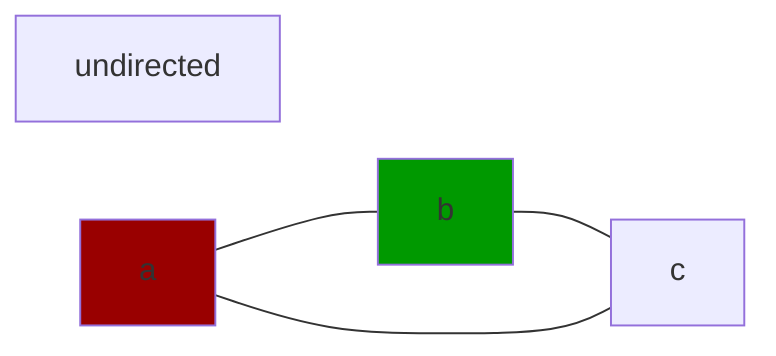

If we seperate the vertices into their colored groups, there should be no edges that connect with vertices of the same group.

To check if a whole graph is connected in an undirected graph:

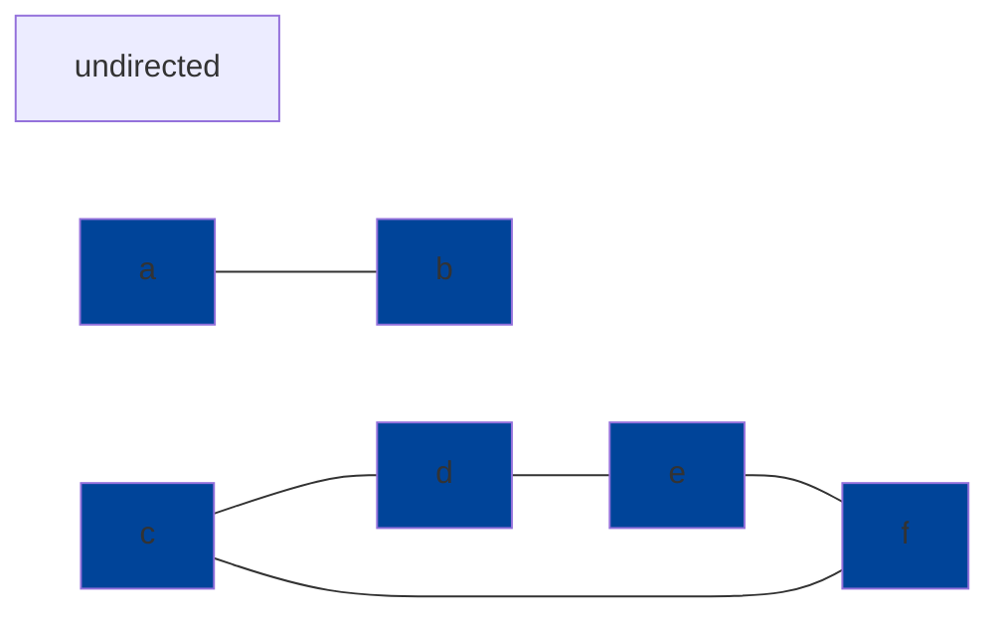

1. Perform BFS `O(E)`
2. Count number of vertices that were seen. If number of vertices is less than `n`, then the graph is not completely connected.

In a directed graph: 

It is considered `doubly connected` if all pairs of vertices have a path a to b and b to a. 

If $c_1$ and $c_2$ are doubly connected partitions of a graph, there is no $X$ that connectes a to b and b to a. If there is a $X$ that is contained in both $c_1$ and $c_2$ then that means both sets are doubly connected. Therefore these two sets are not partitions. So $c_1$ and $c_2$ must be either disjoint or the same graph.

## Dijkstra's Shortest Path Algorithm

`weighted graph` the distance from a node `s` to node `t` is measured by the weights of the graph instead of the number of edges from `s` to `t`.

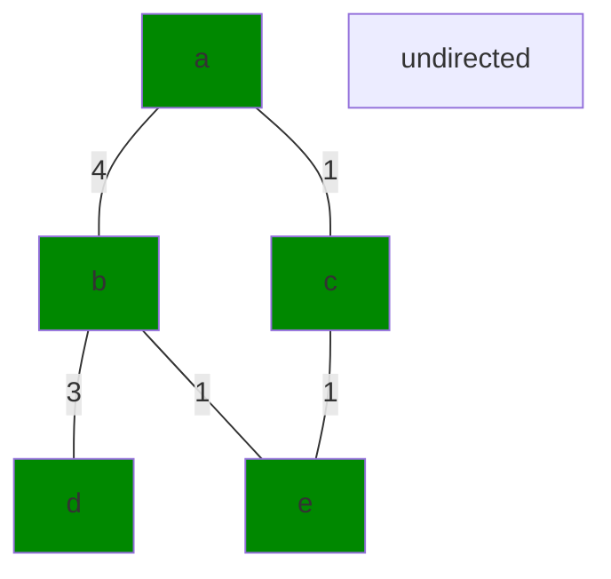

* Let `a` be the starting point
* go to adjacent nodes of visited nodes
* fix the weight of the shortest path

To do this we do the following:

* Pick the minimum of temporary weights and finalize it.

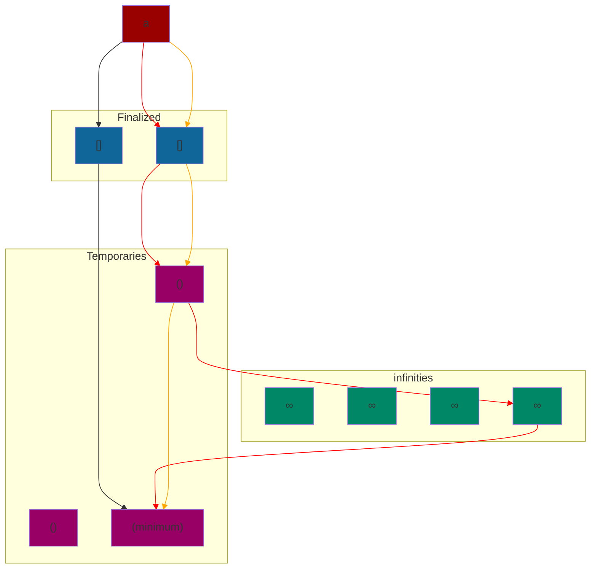

The orange and red path are not minimum paths because all of the weights on the graph are non-negative. We pick a minimum of the temporary weights and finalize it.

### Dijkstra's Algorithm with an Array Implementation:

```
    For n steps:
        pick minimum, x         O(n)
        move it to finalized    O(1)
        modify neighbors of x   O(n)
```

Total runtime of this algorithm is `O(n^2)`

Here is how we modify the adjacent nodes:

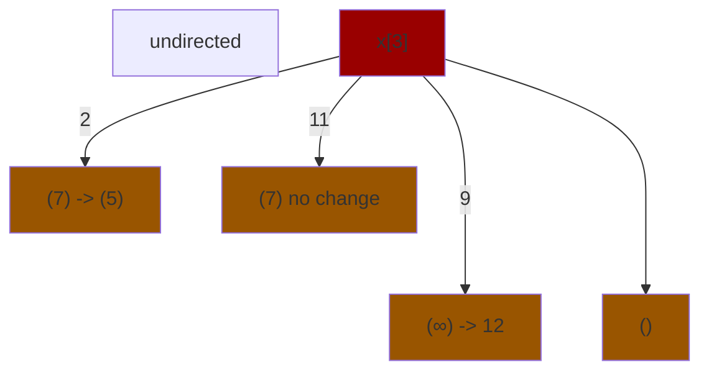

### Dijkstra's Algorithm with a Heap Implementation:

`heap` is a binary tree structure where the nodes follow a property for each sub-tree. A `min heap` has each parent node less than or equal to its child nodes. A `max heap` has each parent node greater than or equal to its child nodes. The smallest value of a min heap is always at the root.


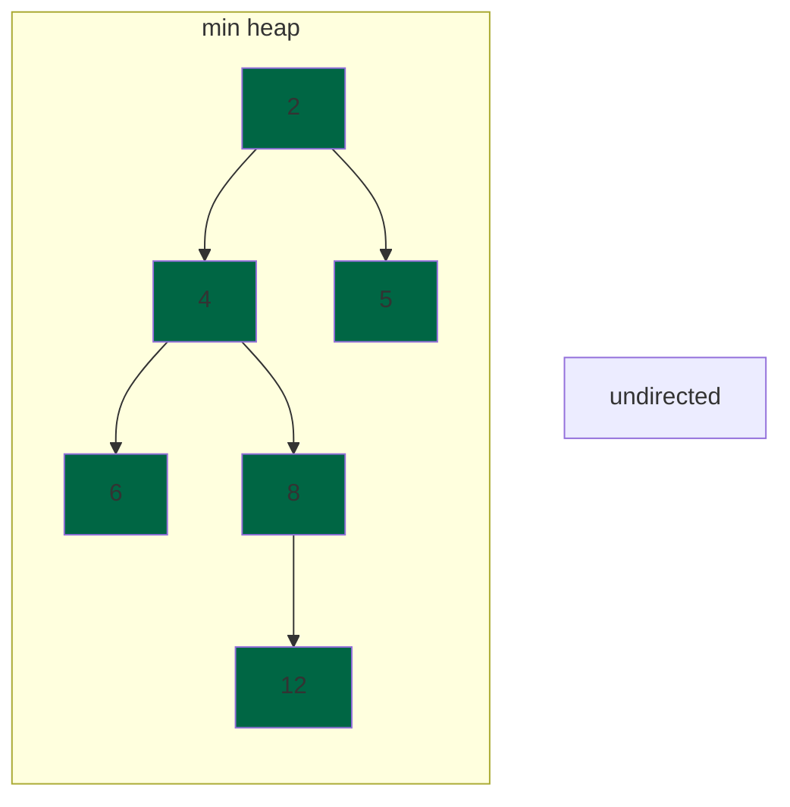

This allows us to access the minimum value of a set of elements in `O(1)` time. When we extract a node, it takes at most `O(logn)` time to fix the tree. The function to fix the tree if it is out of order is `sift up` and `sift down`. We can build the heap using `heapify`.

Dijkstra's algorithm modifies through at most `m` edges time.  So it takes a total run time of `O(mlogn)` when we use a heap instead of arrays.

**Key Note** is it better to have `O(mlogn)` or `O(n^2)`

It depends. If the graph is dense, having an array implementation is better, but if the graph is sparse, a heap implementation is better.

$$
\begin{align*}
m\text{log}n &\ge n^2 \\
m &\ge \frac{n^2}{\text{log}n}
\end{align*}
$$

Mathematically if `m` is greater than or equal to `(n^2)/(logn)` the array implementation is better.

## Spanning Trees

`spanning tree` a tree that touches every vertex. To find a simple spanning tree, just do BFS.

`minimum spanning tree (MST)` is a spanning tree with the smallest sum of weights

`crossing edge` is an edge between two partitions or `cuts` in the graph.

`MST Theorem` there exists an edge `e_min`, that is the lowest weight between any two partition, within the graph for a MST.

### Cut Property Proof:

Suppose that the minimum crossing edge `e` was not in the MST.

* Adding `e` to the MST creates a cycle
* Some other edge `f` must also be a crossing edge
* Removing `f` and adding `e` would reasult in a lower weight spanning tree.
* Contradiction

## Prim's MST Algorithm

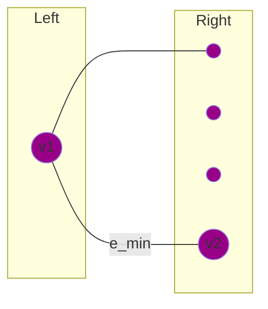

* Arbitrarily put a vertex in the left partition.
* the `degree` of v1 is the number crossing edges from v1 to the right partition.
* put `e_min` in the MST

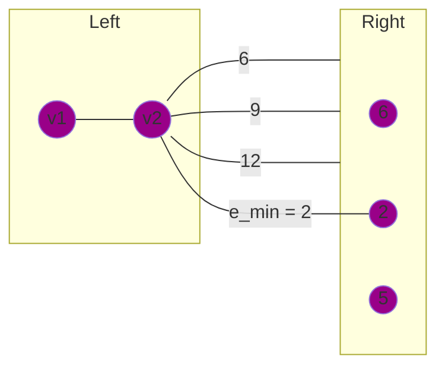

Algorithm:

```
    for i vertices in n-1:
        pick right vertex of e_min and put it in left
```

Runtime Analysis:

* It takes `O(n)` to look at all values on the right and to pick the minimum
* It takes `O(n)` to update the minimum values on the right side
* There are `n-1` steps
* Total Runtime for Array Implementation = `O(n^2)`

Similar to Dijkstra's Shortest Path, we can use a heap implementation to get `O(mlogn)`.

## Kruskal's MST Algorithm

Sort the edges in ascending order. `e_1` is the edge with lowest weight and `e_m` is the edge with greatest weight. This takes `O(mlogm)` time.

Kruskal's Algorithm looks at the smallest edge and creates bipartitions between one of `e_1`'s vertices and the rest of the vertices. We add this edge to the MST and look at the next lowest edge. For isolated edges, this works, but once we see a cycle, there is a problem with adding the edge to the MST.

```mermaid
    graph LR
        subgraph Right
            7@{shape: circle, label: " "}
            8@{shape: circle, label: " "}
            9@{shape: circle, label: " "}
        end
        subgraph Left
            1@{shape: circle, label: " "}
            2@{shape: circle, label: " "}
            3@{shape: circle, label: " "}
            4@{shape: circle, label: " "}
            5@{shape: circle, label: " "}
            6@{shape: circle, label: " "}
        end
        1 --- 2
        2 --- 3
        2 --- 4
        5 --- 6
        7 --- 8 --- 9
        style 1 fill:#089
        style 2 fill:#089
        style 3 fill:#089
        style 4 fill:#089
        style 5 fill:#089
        style 6 fill:#089
        style 7 fill:#089
        style 8 fill:#089
        style 9 fill:#089
        4 -- ok --- 7
```

```mermaid
    graph TB
        subgraph Right
            8@{shape: circle, label: " "}
            9@{shape: circle, label: " "}
        end
        subgraph Left
            1@{shape: circle, label: " "}
            2@{shape: circle, label: " "}
            3@{shape: circle, label: " "}
            4@{shape: circle, label: " "}
            5@{shape: circle, label: " "}
            6@{shape: circle, label: " "}
            7@{shape: circle, label: " "}
        end
        1 --- 2
        2 --- 3
        2 --- 4
        5 --- 6
        7 --- 8 --- 9
        style 1 fill:#089
        style 2 fill:#089
        style 3 fill:#089
        style 4 fill:#089
        style 5 fill:#089
        style 6 fill:#089
        style 7 fill:#089
        style 8 fill:#089
        style 9 fill:#089
        7 -- not ok --- 9
        linkStyle 6 stroke: red
```

## Union-Find Data Structure

$$
\begin{align*}
S_1 &=\{4, 6, 7\}\\
S_2 &=\{5\}\\
\end{align*}
$$

Given two numbers, the `find` operation returns whether they are in the same set.

Given two sets, the `union` operation puts them in the same set.

Our sets can be represented by:

```mermaid
    graph LR
        subgraph " "
            direction BT
            5@{shape: circle}
        end
        subgraph " "
            direction BT
            7@{shape: circle} --> 6@{shape: circle} --> 4@{shape: circle}
        end
        style 5 fill:#387
        style 4 fill:#387   
        style 6 fill:#387
        style 7 fill:#387
        4 ---> 5
        linkStyle 2 stroke: red
```

`find` traverse each element to root `O(n)` and returns the root

`union` point the head of the one root to the tail of another `O(1)`

This takes too much time to `find` if an element is in the tree. Consider the following:

```mermaid
    graph LR
        subgraph " "
            direction BT
            5@{shape: circle}
        end
        subgraph " "
            direction BT
            6@{shape: circle} --> 4@{shape: circle}
            7@{shape: circle} --> 4
        end
        style 5 fill:#387
        style 4 fill:#387   
        style 6 fill:#387
        style 7 fill:#387
        4 ---> 5
        7 ---> 5
        6 ---> 5
        linkStyle 2 stroke: red
        linkStyle 3 stroke: red
        linkStyle 4 stroke: red
```

`find` traverse each element to root `O(1)` and returns the root

`union` points each element to the root of the other tree `O(n)`

This takes too much time to `union` two trees. 

Instead we assign smaller tree to the root of the bigger tree.

```mermaid
    graph LR
        subgraph " "
            direction BT
            5@{shape: circle}
        end
        subgraph " "
            direction BT
            6@{shape: circle} --> 4@{shape: circle}
            7@{shape: circle} --> 4
        end
        style 5 fill:#387
        style 4 fill:#387   
        style 6 fill:#387
        style 7 fill:#387
        5 ---> 4
        linkStyle 2 stroke: red
```

`union` takes `O(1)` because it points the root of the smaller tree to the root of the bigger tree in one step. 

`find` takes `O(logn)` = `O(h)`, where h is the height of the tree, because the length of the tree grows at most by 1 layer each time a union is performed. The size of the tree doubles every union. The longest path from any child to the root node is `O(logn)`

### Using Union-Find in Kruskal's ALgorithm

```mermaid
    graph TB
        subgraph Graph
            1@{shape: circle, label: "a"}
            2@{shape: circle, label: "b"}
            3@{shape: circle, label: "c"}
            4@{shape: circle, label: "d"}
            5@{shape: circle, label: "e"}
        end
        1 --- 2
        2 --- 3
        3 --- 4
        2 --- 5
        2 -.- 4

        style 1 fill:#930
        style 2 fill:#930
        style 3 fill:#930
        style 4 fill:#930
        style 5 fill:#930
        linkStyle 4 stroke: red
```

```
    Tree of Union-Find
             b
           / \ \
          a   c e
             /
            d
```

* Sort the edges with minimum edge first
* if Find(i) != Find(j) for the two vertices in the edge:
    * add the edge to the MST

This takes `m` steps to look at each edge, and it takes `logm` to do the Find operation. 

Total runtime = `O(mlogm)`
