# Graphs

`Graphs` contain `vertices` and `edges`. 

* A `vertex` is a node or point on a graph
* An `edge` connects vertices

There are many types of graphs:

* `weighted` graphs have edges that have a value/weight assigned to them
* `directed` graphs have one way connections between vertices
* `undirected` graphs, or simply graphs, is a graph that has edges that are the same in either orientation. (a, b) is the same as (b, a)
* `connected` graphs have all vertices on the graph connected together.
* `not connected` graphs have at least two distinct groups of vertices that are connected independently.

$ G = (v, E) $ where $v = \{a,b,c,d\}$ and $E = \{(b,c),(b,a),(b,d)\}$

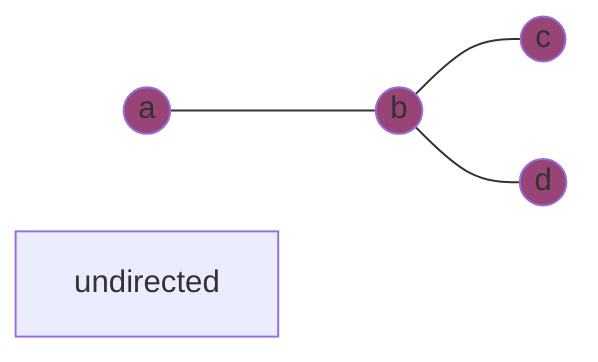

A `simple path` does not repeat any vertices or edges. 

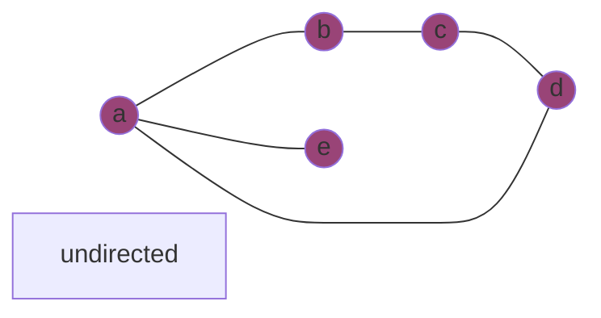

* $a,b,c,d$
* $b,a,e$

A `cycle` ends at the same starting point 

* $a, b, c, d, a$

There are two techniques to searching graphs. `BFS`, breadth first search, and `DFS`, depth first search. We will use the notation: $|v| = n$ and $|E| = e$.

## BFS, Breadth First Search

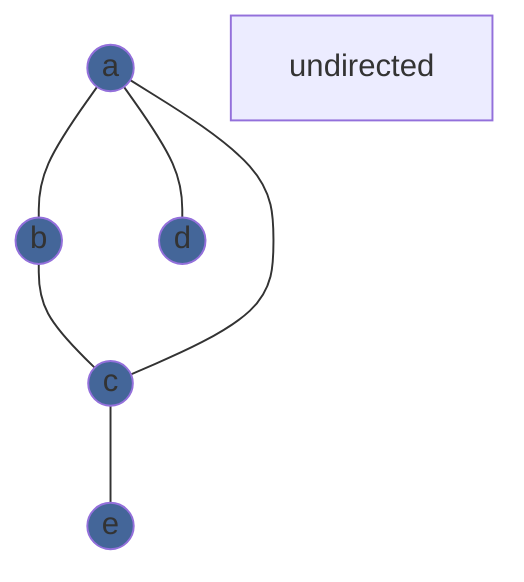

To do a BFS, we visit vertices in layers. 

1. visit $a$ - adjacency list: $b, c, d$
2. visit $b$ - adjacency list: $a, c$
3. visit $c$ - adjacency list: $a, b, e$
4. visit $d$ - adjacency list: $a
5. visit $e$ - adjacency list: $c$

Every vertex checks its link to the previous layer. The runtime $ = 2e = O(E)$

## DFS, Depth First Search

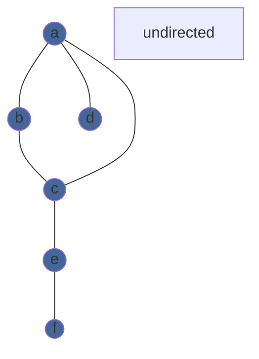

To do a DFS, we visit vertices down to a dead end and then backtrack while looking for more branches in the path.

1. visit $a$ - visited list: $a$
2. visit $b$ - visited list: $a, b$
3. visit $c$ - visited list: $a, b,c$
4. visit $e$ - visited list: $a, b,c,e$
5. visit $f$ - visited list: $a, b,c, e, f$, no more unvisted vertices
6. go back to $e$ - no unvisted vertices
7. go back to $c$ - no unvisted vertices
8. go back to $b$ - no unvisted vertices
9. go back to $a$ - $d$ is unvisted
10. visit $d$ - visited list $a, b, c, e, d, f$, no more unvisted vertices
11. go back to $a$ - no unvisted vertices left

Every visited vertex has to trace back to its previous vertex so the runtime $ = 2e = O(E)$.

There are two ways to keep track of which vertices are connected. `Adjacency Lists` are lists with all the adjacent vertices of a vertex. There are `|v| = n` number of adjacency lists.

* $a \rightarrow b \rightarrow c \rightarrow d$
* $b \rightarrow a \rightarrow c$
* $c \rightarrow a \rightarrow b \rightarrow e$
* $e \rightarrow c \rightarrow f$
* $f \rightarrow e$
* $d \rightarrow a$

It will take $O(n)$ to see if a specific vertex is in an adjacency list. For this reason, adjacency lists are good to use when we have `sparse graphs`.

We can also use matrices to model which vertices are connected:

Undirected graphs' matrices: 

$$\begin{array}{rcl} &\color{white}\begin{array}{c}a & b & c & d & e & f\end{array}\\
\color{white}\begin{matrix} a \\ b \\ c \\ d \\ e \\ f \end{matrix}\color{black}\hspace{-1em}
&\begin{pmatrix}
1&1&1&1&0&0\\
1&1&1&0&0&0\\
1&1&1&0&1&0\\
1&0&0&1&0&0\\
0&0&1&0&1&1\\
0&0&0&0&1&1\\
\end{pmatrix} 
\end{array}
$$ 

are always symmetric because of the nature how pairs of vertices will have the same edge.

Directed graphs' matrices: $\begin{array}{rcl} &\color{white}\begin{array}{c}a & b\end{array}\\
\color{white}\begin{matrix} a \\ b\end{matrix}\color{black}\hspace{-1em}
&\begin{pmatrix}
1&1\\
0\\
\end{pmatrix} 
\end{array}
$ may not be symmetric. In this example, $a \rightarrow b$, the source node is represented by the matrix's rows and the target node is represented with the columns.

### Example:

#### If the graph is connected, what is the minimum number of edges?

There are `n` vertices in a connected graph. The minimum number of edges is `n-1`. So for all graphs, the number of edges lies within $n-1 \le e$. A tree is described as a graph with exactly $e = n-1$ edges. Graphs with generally small number of edges is considered a `sparse graph`.

#### If the graph is connected, what is the max number of edges?

Since each edge has 2 vertices, the max number of edges can be described by:

$$
{n\choose 2} = \frac{(n-1)(n)}{2}
$$

This is called a `complete graph`. All of the vertices are connected with each other, so that there is no vertex that is not matched with all others in the graph. This is considered a `dense graph`.

## How are BFS and DFS Implemented?

Let's go back to the example used for BFS:

For BFS, we use a `FIFO` first-in-first-out data structure.

```mermaid
    graph LR
        subgraph Priority Queue
            direction LR
            a --- c
            c --- b
            b --- d
            d --- e
        end
        style a fill:#036
        style b fill:#036
        style c fill:#036
        style d fill:#036
        style e fill:#036
```

For DFS, we use a `FILO` first-in-last-out data structure.

```mermaid
    graph LR
        subgraph Stack1
            direction TB
            e --- c
            c --- b
            b --- a1
        end
        subgraph Stack2
            direction TB
            d --- a2
        end
        Stack1 ---> Stack2
        style a1 fill:#036
        style a2 fill:#036
        style b fill:#036
        style c fill:#036
        style d fill:#036
        style e fill:#036
```

`Length` is the number of edges from one vertex to another.

`Distance` is the length of the shortest path from one vertex to another.

* this is denoted as `dist(a,x)` where `a` and `x` are vertices.

Prove: dist($a$,$x$) = level of $x$

* we need to prove that there is a path of length $i$ from $a$ to $x$.
* we need to prove that there is no shorter path, length $j$ from $a$ to $x$

Assume that $a$ is on level 0 and $x$ is on level $i$. Do BFS.

```mermaid
    graph LR
        subgraph level i
            direction TB
            x
        end
        subgraph level 1
            direction TB
            e
            f
            g
        end
        subgraph level 0
            direction TB
            a
            b
            c
            d
        end
        style b fill:#036
        style c fill:#036
        style d fill:#036
        style e fill:#036
        style a fill:#036
        style f fill:#036
        style g fill:#036
        style x fill:#036
```

$$
\exists \text{ path of length } i \text{ between }x\text{ and }a
$$

By Contradition: Assume there is a shorter path of length $j$

| Level | possible path length |
| --- | --- |
| 0 | 0 |
| 1 | 1 |
| 2 | 2, 1 |
| 3 | 3, 2, 1 |
| $\vdots$ | $\vdots$ |
| $x$ | $j$, $j$-1, $j$-2, ... , 1 |

$j$ could be at either level $j$ or any lower levels because some vertices are connected closer to $a$ at level 0.

Example: A triangle formed by $a$, $b$, $c$. If $a$ is the starting point, $b$ and $c$ are both on level 1, eventhough we may travel from $a \rightarrow b \rightarrow c$ to reach $c$. A straight line is the example of them descending levels after every edge.

However, since $x$ is at level $i$, which is a different number from $j$, and $x$ cannot be in multiple levels at the same time, there must be no shorter path of length $j$ from $a$ to $x$.

## Topological Sorting

`topological sorting` is an ordering with vertices such that the edges follow the precedence relationship.

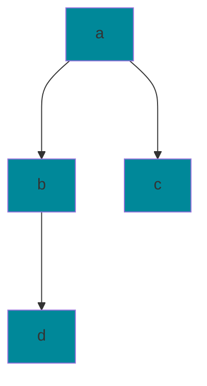

Vertices represent tasks. Edges represent the precedence relationship. Example: `(a, b)` means that `a` has to be done before `b`.

The following are correct topological orderings:

* `a b d c`
* `a b c d`

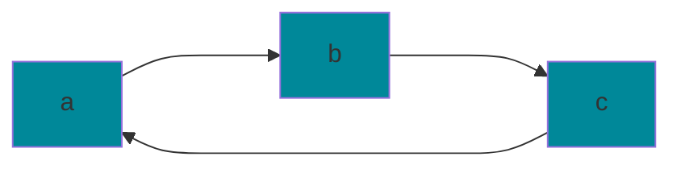

In this graph, we say that `b` is adjacent to `a` but `a` is not adjacent to `b` because it is directed. `Cycles` do not have topological ordering. We denote this triangular graph as `C3`, a cycle with length 3.

In an undirected graph: `degree` of a vertex is the number of edges that it is connected to.

In a directed graph:

* `in-degree` of a vertex is the number of incoming edges.
* `out-degree` of a vertex is the number of outward edges.

A vertex with in-deg = 0 is a `source`.

A vertex with out-deg = 0 is `sink`.

`DAG` is a directed acyclic graph. DAGs must have at least one source.

### Solution to Determining the Topological Ordering of a DAG:

1. Calculate all indegrees. `O(e)`
2. if in-deg = 0, it is a source. `O(n)`
3. Find a source. `O(1)`
4. Output source. `O(1)`
5. Decrement in-deg from vertices that connect to the deleted source. For the whole algorithm this takes `O(e)`

Runtime = `O(n + e)`

### 2-coloring

a graph is `2-colorable` if no adjacent vertices have the same color.

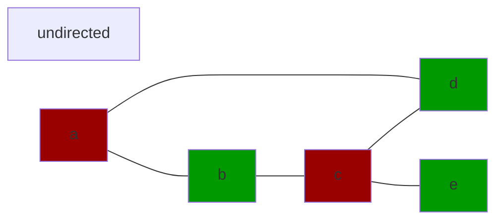

graphs that contain odd length cycles are not 2-colorable

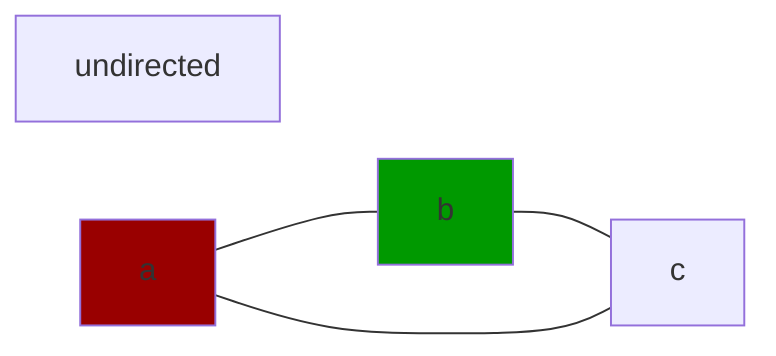

If we seperae the vertices into their colored groups, there should be no edges that connect with vertices of the same group.

To check if a whole graph is connected in an undirected graph:

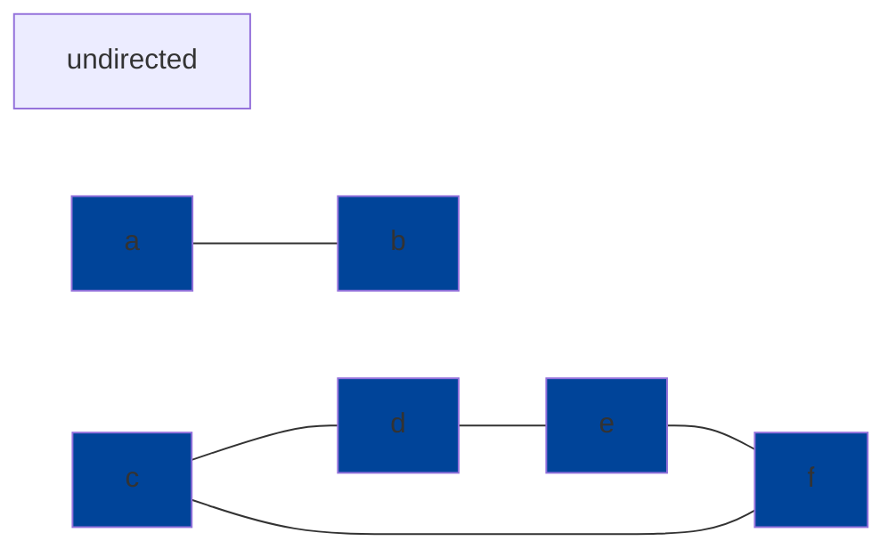

1. Perform BFS `O(E)`
2. Count number of vertices that were seen. If number of vertices is less than `n`, then the graph is not completely connected.

In a directed graph: 

It is considered `doubly connected` if all pairs of vertices have a path a to b and b to a. 

If $c_1$ and $c_2$ are doubly connected partitions of a graph, there is no $X$ that connectes a to b and b to a. If there is a $X$ that is contained in both $c_1$ and $c_2$ then that means both sets are doubly connected. Therefore these two sets are not partitions. So $c_1$ and $c_2$ must be either disjoint or the same graph.

