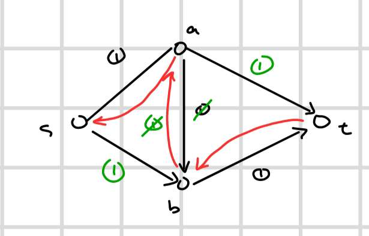

# Network Flow (ST-network)

`Network` is a directed graph. Each network has a source and terminating vertex.

`links` are the edges between every node. Each link has a `capacity`.

The items we send through a link is called `flow`.

The flow must be less than or equal to the link's capacity.

$$
f_i \le c_i
$$

$$
c_i \ge 0
$$

Conservation of flow:

$$
\sum_{\rightarrow v_i} f_i = \sum_{v_i\rightarrow} f_i
$$

all the flow entering is equal to flow exiting $v_i$ for all $v_i$ except $s$ and $t$.

What is the maximum amount of flow through a graph?

In this network, the maxflow is 6.

A saturated edge is an edge where capacity is equal to flow

Say we create a backlink equal to the flow sent. Then we can change our minds if we want to send flow back through this backlink.

Say we have an edge with all links that have capacity of 1 flow.

## Algorithm: Ford and Fulkerson

* pick any path from $s$ to $t$
* send 1 flow through this path
* create a residual edge from that path with capacity equal to the flow that was sent
* repeat until all paths are saturated

The time complexity for ford-fulkerson is `fe`, where we send `f` flow times through `e` number of edges.

### ST-Cut

The capacity of a ST-Cut is the sum of all capacities that can go from the partition containing $S$ to the partition containing $T$. Of all ST-Cuts, consider the one with the minimum capacity. Call this the `min cut`. It is the bottle neck of the graph.

The optimal solution may or may not be unique.

1. $f$ is maxflow in $N$
2. the residual network $N_f$ has no more augmenting paths
3. $f$ is $C(S, T)$ for some cut $(S, T)$

Proof: 

#### 1 to 2

Assume $f$ is the maxflow and there is an augmented path in the residual network.

* Then we can send 1 flow across this path
* This increases maxflow by 1 which is a contradiction

#### 2 to 3

put all reachable nodes from $s$ on left partition and the rest of the nodes on right partition after ignoring saturated edges

* then there is a cut with flow = capacity

#### 3 to 1

Every $|f|$ must be less than or equal to the capacity of a cut.

$$
\begin{align*}
|f| &\le 10\\
|f| &\le 1 \\
|f| &\le 100
\end{align*}
$$

From all the cuts in a graph, the minimum cut is equal to the maxflow of the graph

### Design Problem:

There are towers with some number of cellphones. How do we assign cellphones to towers? The cellphones have a radius $R$ to where it can connect. Each tower has a capacity.

* a flow is a legal assignment from cellphone to tower
* each cellphone gets assigned to one tower
* towers have a capacity
* so the maxflow of this network is the solution from Ford and Fulkerson algorithm
