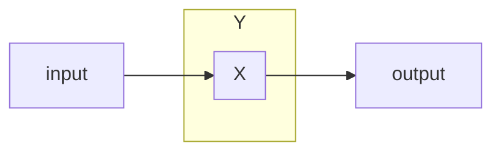

# NP Complete or NP Hard

problems that are difficult to solve in polynomial time

### Traveling Salesman Problem

* need to go to all cities
* the total distance traveled needs to be minimized
* brute force algorithm takse `n!` time

### Satisfiability

* can be represented in boolean algebra
* is there an assignment of `0`'s and `1`'s such that a boolean expression is satisfiable

### Max Clique

* pairwise connected vertices from a a clique
* what is the maximum number of vertices in a clique of a graph

### Max Independent Set

* subset of vertices that are not pairwise connected
* what is the max number of independent vertices

### Set Cover

* give the minimum number of sets to cover a given set

### Vertex Cover

* what is the minimum number of vertices that touches every edge?

## Problem Transformation

if you have a problem `X` and you have a bigger problem `Y`:

`Y` is polynomial transformable to `X`

$$
Y \le_p X
$$

1. suppose $Y \le_p X$ then $X$ can be solved in polynomial time
2. suppose $Y \le_p X$. if $Y$ cannot be solved in polynomial time, then $X$ cannot be solved in polynomial time

#### Max Clique is NP Complete

$MC \le_p MIS$

Let `G'` be the complement edges of `G`.

If there was a way to transform `G` to `G'` and we know `MC` is NP hard, then `MIS` is also NP hard because we can transform `MIS` into a `MC` problem. If there was a larger independent set in `G'`, then there must be a larger clique, by construction of the graph of `G'`

#### Show $VC \le_p SC$

Assume `VC` is NP complete

* since we can transform `VC` to `SC` in polynomial time, `SC` is also NP complete.
